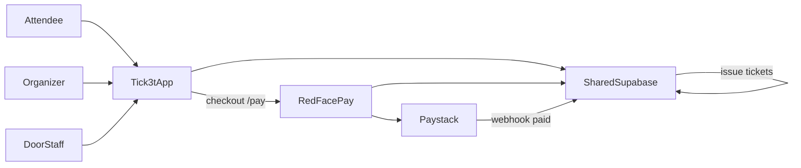

# Tick3t — Architecture

## High-level split



## Repositories

| Repo | Role |
|------|------|
| **Tick3t** (this) | Vite SPA: discovery, event UX, organizer OS, staff scanner, admin shell |
| **Redface-pay** | Payment OS + shared Supabase migrations + edge functions |

## Identity

- Clerk for UI auth (when configured).
- Supabase Auth session for RPCs (SSO from RedFace Pay when returning with tokens).
- Organizers map to `tick3t_organizers` ↔ `merchants`.
- Platform admins: `platform_ecosystem_apps.admin_emails` + `src/lib/tick3t/admins.ts`.

## Data (hub)

Core tables:

- `tick3t_events` — event workspace  
- `tick3t_ticket_types` — SKUs (price, capacity, sale windows)  
- `tick3t_organizers` — seller applications  
- `tick3t_scan_log` — check-in audit  
- `tick3t_staff` — door/ops roles (Phase 1)  
- `tick3t_promo_codes` — discounts (Phase 1)  
- `tick3t_refund_requests` — refund workflow (Phase 1)  
- `merchant_event_tickets` — issued tickets (QR, status) — shared with Entendre  

## Commerce path

1. Tick3t builds checkout URL: `REDFACE_PAY_ORIGIN/pay?ecosystem_from=tick3t&…`  
2. Pay `init_payment` treats Tick3t lines as **ticket metadata**, not catalog products.  
3. Paystack confirms → webhook / trigger → `issue_event_tickets_for_transaction`.  
4. Buyer sees tickets on `/tickets`; door validates via `tick3t_validate_and_checkin`.

## Service boundaries

**Tick3t may:**

- CRUD events, ticket types, staff, promos, refund *requests*  
- Render dashboards from RPC aggregates  
- Deep-link to Pay for checkout, payouts UI, merchant onboarding  

**Tick3t must not:**

- Call Paystack directly  
- Store card data  
- Invent a second wallet or settlement ledger  

**RedFace Pay owns:**

- `init_payment`, webhooks, subaccounts, fees, payouts, invoices, store credit  

## Frontend modules

```
src/pages/          # Route-level screens
src/components/tick3t/
src/lib/tick3t/     # API wrappers, types, QR helpers, admins
src/contexts/       # Auth
```

## Multi-country

Design for multi-currency and localization early; Phase 1 ships ZAR / South Africa defaults via Pay.

## Scaling notes

- Check-in RPCs are merchant-scoped and idempotent on QR.  
- Offline scanner queues payloads in `localStorage` and flushes when online.  
- Public catalog RPCs are security definer and read-only for anon.
